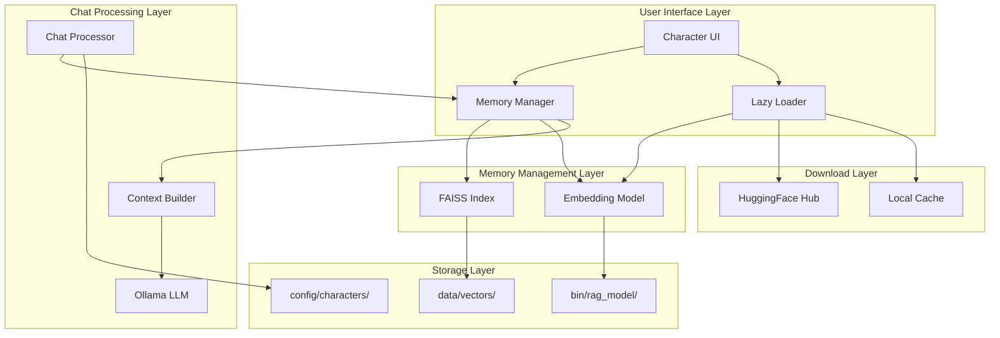

# FAISS RAG System Implementation Plan

## Overview

This document outlines the implementation plan for integrating FAISS-based RAG (Retrieval-Augmented Generation) into the chatbot application. The system will provide character memory cards with semantic search capabilities for enhanced AI responses.

## Architecture Diagram



## Implementation Phases

### Phase 1: Dependencies and Infrastructure

#### 1.1 Update Requirements
- Add `faiss-cpu` and `sentence-transformers` to requirements.txt
- Ensure compatibility with PyInstaller build process

#### 1.2 Directory Structure Setup
```
project_root/
├── bin/
│   └── rag_model/           # Embedding model cache (lazy loaded)
├── data/
│   └── vectors/            # FAISS index files (.index)
└── config/
    └── characters/         # Character JSON files (existing)
```

#### 1.3 Lazy Loading System
- Create `LazyModelLoader` class
- Implement HuggingFace model download with progress tracking
- Add model validation and fallback mechanisms

### Phase 2: Core Memory Management

#### 2.1 MemoryManager Class
```python
class MemoryManager:
    def __init__(self, character_name: str)
    def load_or_create_index(self) -> bool
    def rebuild_index(self) -> bool
    def search(self, query: str, k: int = 3) -> List[str]
    def get_card_count(self) -> int
    def is_index_valid(self) -> bool
```

#### 2.2 FAISS Integration
- Use `IndexFlatL2` for exact search (optimal for small datasets)
- Implement vector dimension handling (384 for MiniLM)
- Add index persistence and loading mechanisms

#### 2.3 Embedding Model Integration
- Use `paraphrase-multilingual-MiniLM-L12-v2`
- Implement text preprocessing pipeline
- Add caching for frequently used embeddings

### Phase 3: Chat Integration

#### 3.1 Context Builder
- Modify `chat_actions.py` to include memory search
- Implement context formatting for Ollama
- Add relevance threshold checking

#### 3.2 Search Pipeline
```
User Input → Embedding → FAISS Search → Context Assembly → LLM Prompt
```

#### 3.3 Performance Optimization
- Cache embeddings for repeated queries
- Implement batch processing for multiple cards
- Add timeout handling for slow operations

### Phase 4: UI Integration

#### 4.1 Character Page Enhancements
- Add "Refresh Memory" button
- Display memory card count and status
- Show index rebuild progress

#### 4.2 Dashboard Integration
- Add memory status indicator
- Show active character memory stats
- Provide quick access to memory management

### Phase 5: Build and Deployment

#### 5.1 PyInstaller Configuration
- Exclude unnecessary FAISS dependencies
- Use `--onedir` mode for better stability
- Optimize binary size with selective module inclusion

#### 5.2 Error Handling
- Graceful fallback when FAISS unavailable
- Model download failure recovery
- Index corruption detection and repair

## Technical Specifications

### Embedding Model Details
- **Model**: `paraphrase-multilingual-MiniLM-L12-v2`
- **Size**: ~150MB
- **Dimensions**: 384
- **Languages**: Multilingual (RU/EN/ES/FR/DE/IT)

### FAISS Configuration
- **Index Type**: `IndexFlatL2`
- **Metric**: L2 distance
- **Search K**: 3 most relevant cards
- **Threshold**: Dynamic based on dataset size

### Storage Format
- **Index Files**: `.index` binary format
- **Model Cache**: HuggingFace transformers format
- **Character Data**: Existing JSON structure (unchanged)

## Implementation Timeline

### Week 1: Foundation
- [ ] Update requirements and directory structure
- [ ] Implement lazy loading system
- [ ] Create basic MemoryManager skeleton

### Week 2: Core Functionality
- [ ] Complete FAISS integration
- [ ] Implement embedding model loading
- [ ] Add index creation and management

### Week 3: Integration
- [ ] Modify chat processing pipeline
- [ ] Add context building logic
- [ ] Implement UI controls

### Week 4: Polish and Testing
- [ ] Add comprehensive error handling
- [ ] Optimize for PyInstaller build
- [ ] Create documentation and tests

## Risk Mitigation

### Dependency Risks
- **FAISS CPU vs GPU**: Use `faiss-cpu` to avoid CUDA dependencies
- **Model Availability**: Cache model locally after first download
- **Version Conflicts**: Pin specific versions in requirements.txt

### Performance Risks
- **Memory Usage**: Monitor RAM usage during index operations
- **Search Latency**: Implement caching for frequent queries
- **Index Size**: Use efficient storage formats

### Compatibility Risks
- **PyInstaller Issues**: Test build process thoroughly
- **Platform Differences**: Ensure Windows/Linux compatibility
- **Python Version**: Support Python 3.8+ consistently

## Success Criteria

### Functional Requirements
- [ ] Character memory cards searchable via semantic similarity
- [ ] Automatic index rebuilding when character data changes
- [ ] Lazy loading of embedding model on first use
- [ ] Integration with existing Ollama LLM pipeline

### Performance Requirements
- [ ] Memory search completes in <100ms for typical datasets
- [ ] Index rebuild completes in <30 seconds for 200K characters
- [ ] Model download completes in <5 minutes on average connection

### User Experience Requirements
- [ ] Seamless integration with existing character management
- [ ] Clear visual feedback for memory operations
- [ ] Graceful degradation when RAG unavailable

## Testing Strategy

### Unit Tests
- MemoryManager core functionality
- FAISS index operations
- Embedding model loading

### Integration Tests
- End-to-end memory search workflow
- Character activation with memory loading
- UI integration testing

### Performance Tests
- Search latency under various dataset sizes
- Memory usage during index operations
- Model download and caching performance

### Compatibility Tests
- PyInstaller build verification
- Cross-platform functionality
- Python version compatibility